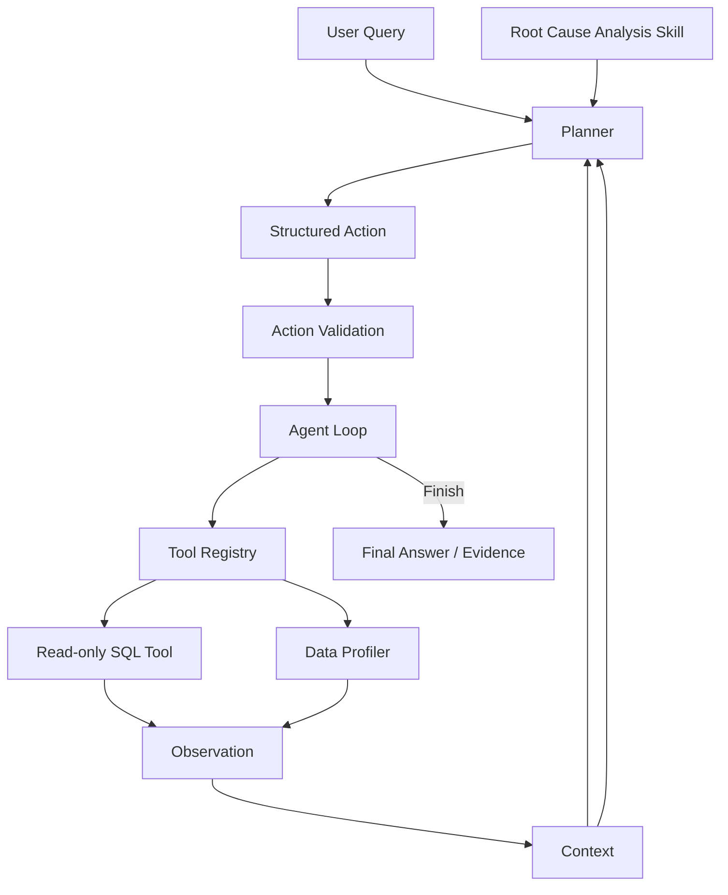

# BusinessInsight Agent

**Business anomaly detection and root-cause analysis with SQL, Python, Tableau, and an AI Agent.**

BusinessInsight Agent is a portfolio project built on the Olist Brazilian E-Commerce Dataset. It combines traditional business analytics with an LLM-based agent workflow to monitor business metrics, detect anomalies, break down metric changes, drill into key dimensions, and generate evidence-grounded reports.

The project focuses on three core business metrics:

- Product GMV
- Order Volume
- Average Order Value (AOV)

The full analysis flow is:

```text
Data Quality Check
        ↓
Monthly KPI Monitoring
        ↓
Anomaly Detection
        ↓
Metric Decomposition
        ↓
Dimension Attribution
        ↓
Drill Down
        ↓
Evidence Validation
        ↓
Business Report
```

## Key Finding

Among comparable complete months, the largest absolute GMV decline occurred between **2017-11 and 2017-12**.

| Metric | 2017-11 | 2017-12 | MoM |
|---|---:|---:|---:|
| Product GMV | 1,010,271.37 | 743,914.17 | **-26.36%** |
| Order Volume | 7,451 | 5,624 | **-24.52%** |
| AOV | 135.59 | 132.27 | **-2.44%** |

Using the identity

```text
GMV = Order Volume × AOV
```

the GMV decline was decomposed into two components:

| Driver | GMV Impact | Contribution |
|---|---:|---:|
| Order Volume | -244,693.42 | **91.87%** |
| AOV | -21,663.78 | **8.13%** |
| Total | -266,357.20 | 100% |

This suggests that the December GMV decline was mainly associated with lower order volume rather than a large change in AOV.

This is an arithmetic decomposition, not a causal claim.

Further attribution was performed across:

- Product Category
- Customer State
- Seller

For example, **SP** contributed **29.85%** of the total GMV decline and was selected for further drill-down analysis.

## Business Analysis

### Metric Definitions

| Metric | Definition |
|---|---|
| Product GMV | `SUM(order_items.price)` |
| Order Volume | `COUNT(DISTINCT order_id)` |
| AOV | Product GMV / Order Volume |
| Month | Calendar month of `order_purchase_timestamp` |
| GMV MoM | Month-over-month Product GMV change |

Product GMV represents the value of purchased items and is not interpreted as net revenue after refunds or cancellations.

The analysis also avoids directly aggregating across multiple one-to-many joins such as:

```text
order_items → orders ← payments
```

Tables are aggregated to the correct grain before joining to prevent duplicated monetary values.

### Anomaly Detection

An exploratory threshold was used to identify significant monthly declines:

```text
GMV MoM <= -10%
```

Only adjacent complete months were compared.

Major detected declines included:

| Month | GMV Change | GMV MoM |
|---|---:|---:|
| 2017-12 | -266,357.20 | **-26.36%** |
| 2018-06 | -131,393.37 | -13.19% |
| 2018-02 | -105,851.65 | -11.14% |
| 2017-06 | -73,032.54 | -14.43% |

The 2017-11 → 2017-12 period was selected because it had the largest absolute GMV decline.

### Dimension Attribution

For each dimension member, the analysis calculates:

```text
Previous GMV
Current GMV
Absolute Change
Growth Rate
Contribution Rate
```

where

```text
Contribution Rate
= Dimension Member GMV Change / Total GMV Change
```

Main contributors included:

| Dimension | Member | GMV Change | Contribution |
|---|---|---:|---:|
| Category | `cama_mesa_banho` | -38,906.69 | **14.61%** |
| Customer State | `SP` | -79,511.75 | **29.85%** |
| Seller | `7e93a43ef30c4f03f38b393420bc753a` | -19,384.78 | **7.28%** |

These dimensions are separate analytical views, so their contribution rates should not be added together.

### Drill Down

Since SP had the largest state-level contribution, it was selected for further analysis.

#### SP → Category

```text
cama_mesa_banho

37,541.65 → 23,143.70

Change = -14,397.95
Contribution to SP decline = 18.11%
```

#### SP → Seller

```text
Seller:
7e93a43ef30c4f03f38b393420bc753a

8,434.87 → 379.00

Change = -8,055.87
Contribution to SP decline = 10.13%
```

## Tableau Dashboard

A Tableau dashboard was created to visualize the analysis.

It includes:

- GMV trend and anomaly detection
- Product GMV KPI
- Order Volume KPI
- AOV KPI
- GMV MoM KPI
- GMV driver decomposition
- Category contribution
- State contribution
- Seller contribution
- SP drill-down

Workbook:

[BusinessInsight_Dashboard_public.twb](output/tableau/BusinessInsight_Dashboard_public.twb)

Supporting Tableau data and documentation:

[Tableau README](output/tableau/README.md)

## Agent Architecture

The second part of the project extends the deterministic analytics workflow into an AI Agent.

Instead of directly generating conclusions, the model selects tools, receives observations, updates context, and decides the next analysis step.



The basic loop is:

```text
Decision
   ↓
Action
   ↓
Tool Execution
   ↓
Observation
   ↓
Context Update
   ↓
Next Decision
```

## Tools

### Data Profiler

Used to inspect:

- table schema
- column metadata
- dataset size
- basic data quality

### Read-only SQL Tool

The SQL tool is restricted to:

```text
SELECT / WITH
```

Additional safeguards include:

- SQL action validation
- SQLite authorizer
- row limits
- structured error observations

If a SQL query fails, the error is returned to the planner as an observation.

For example:

```text
Ambiguous SQL column
        ↓
Tool Error
        ↓
Observation
        ↓
Planner fixes alias
        ↓
Query succeeds
```

## Context Management

The agent does not place the full database or unlimited interaction history into the prompt.

Context is managed through:

- Schema Compaction
- Observation History
- Evidence Preservation
- Structured Compaction

This keeps the prompt relatively small while preserving evidence needed for later analysis.

## Root Cause Analysis Skill

A reusable root-cause-analysis skill is defined in:

```text
skills/root-cause-analysis/SKILL.md
```

The skill describes the general workflow:

```text
Metric Definition
        ↓
Period Validation
        ↓
Anomaly Detection
        ↓
Metric Decomposition
        ↓
Dimension Attribution
        ↓
Dynamic Drill Down
        ↓
Evidence / Hypothesis
```

It defines the analysis method rather than hard-coding SQL queries, so the planner can still choose actions based on previous observations.

## MCP Integration

The project also includes a local MCP integration.

```text
Agent
 ↓
MCP Registry
 ↓
MCP Client
 ↓
stdio
 ↓
MCP Server
 ↓
SQL Tool / Data Profiler
```

The current implementation uses local `stdio` transport.

## Evidence-grounded Reporting

The report generator only uses validated observations as numerical evidence.

```text
Successful Observation
        ↓
Evidence Mapping
        ↓
Consistency Validation
        ↓
Structured Report
        ↓
Markdown
```

The generated report contains sections such as:

```text
executive_summary
anomaly_overview
metric_decomposition
dimension_attribution
drill_down_findings
evidence
hypotheses
limitations
recommended_next_checks
```

The LLM is mainly used to select evidence and organize the report rather than invent business metrics.

Example:

[agent_business_report.md](output/reports/agent_business_report.md)

## Evaluation

The offline evaluation suite covers:

1. Metric correctness
2. Period correctness
3. Anomaly detection
4. Decomposition correctness
5. Dimension attribution
6. Drill-down quality
7. Evidence grounding
8. Hypothesis discipline
9. Tool safety
10. Task completion

Ground-truth answers are kept separate from the planner during evaluation.

## Error Recovery and Fallback

The project distinguishes between tool errors and external model failures.

Tool errors can be returned to the agent as observations and retried.

For failures such as:

```text
HTTP 429
Timeout
Empty Response
Invalid Structured Output
```

the demo and report generation pipeline can fall back to deterministic replay based on previously validated evidence.

Fallback execution is explicitly recorded:

```text
fallback_used = true
```

so deterministic replay is not presented as successful live LLM reasoning.

## Offline Demo

A complete demo can be run without an API key:

```bash
python scripts/run_business_insight_demo.py --mode offline
```

The offline pipeline is:

```text
Business Question
        ↓
Validated Analysis Replay
        ↓
Evidence Validation
        ↓
Report Generator
        ↓
Business Report
        ↓
Tableau Deliverable
```

Outputs include:

```text
output/demo/demo_summary.md
output/demo/demo_trace.json
output/reports/agent_business_report.md
```

The offline demo does not require:

- an API key
- raw CSV files
- the local SQLite database
- an external LLM service

## Testing

Current offline test status:

```text
99 / 99 PASS
0 skipped
```

Tests cover:

- SQL Tool
- Data Profiler
- Agent Loop
- Action Validation
- Context Management
- MCP
- Report Generator
- Evidence Validation
- Fallback
- End-to-End Demo

## Project Structure

```text
BusinessInsight-Agent/
│
├── src/
│   ├── agent.py
│   ├── planner.py
│   ├── context.py
│   ├── report_generator.py
│   ├── tools/
│   └── mcp_integration/
│
├── scripts/
│   ├── run_business_insight_demo.py
│   └── demo_business_report.py
│
├── skills/
│   └── root-cause-analysis/
│       └── SKILL.md
│
├── evals/
├── tests/
├── docs/
│
├── output/
│   ├── reports/
│   ├── demo/
│   └── tableau/
│
├── DATA_NOTICE.md
├── requirements.txt
└── requirements-mcp.txt
```

## Quick Start

Run the offline demo:

```bash
python scripts/run_business_insight_demo.py --mode offline
```

Install the main dependencies:

```bash
pip install -r requirements.txt
```

For MCP support:

```bash
pip install -r requirements-mcp.txt
```

The raw Olist dataset is not included in this repository.

See:

[DATA_NOTICE.md](DATA_NOTICE.md)

## Quick Links

- [Portfolio Guide](docs/portfolio_guide.md)
- [Business Analysis Report](output/reports/agent_business_report.md)
- [Tableau Dashboard](output/tableau/BusinessInsight_Dashboard_public.twb)
- [Tableau Documentation](output/tableau/README.md)
- [Demo Summary](output/demo/demo_summary.md)
- [Demo Trace](output/demo/demo_trace.json)
- [Report Generation](docs/report_generation.md)

## Scope

This project is intended as a **business analytics + AI Agent engineering portfolio project**, rather than a production BI platform.

Currently implemented and tested:

- SQL/Python business analysis
- KPI monitoring and anomaly detection
- GMV decomposition
- multi-dimensional attribution
- drill-down analysis
- Tableau dashboard
- Agent Loop
- Tool Calling
- read-only SQL execution
- context management
- reusable Skill
- MCP integration
- offline evaluation
- evidence-grounded report generation
- offline demo
- 99 offline tests

Current limitations:

- MCP currently uses local `stdio`.
- The offline demo is a deterministic replay of validated evidence.
- Live agent execution depends on external LLM availability.
- Transaction data can identify metric movements and concentration of contribution, but cannot by itself establish operational causes such as traffic, promotion, inventory, or merchant strategy.

## Tech Stack

`Python` · `SQL` · `SQLite` · `Tableau` · `LLM` · `MCP` · `Structured Output` · `Eval`
