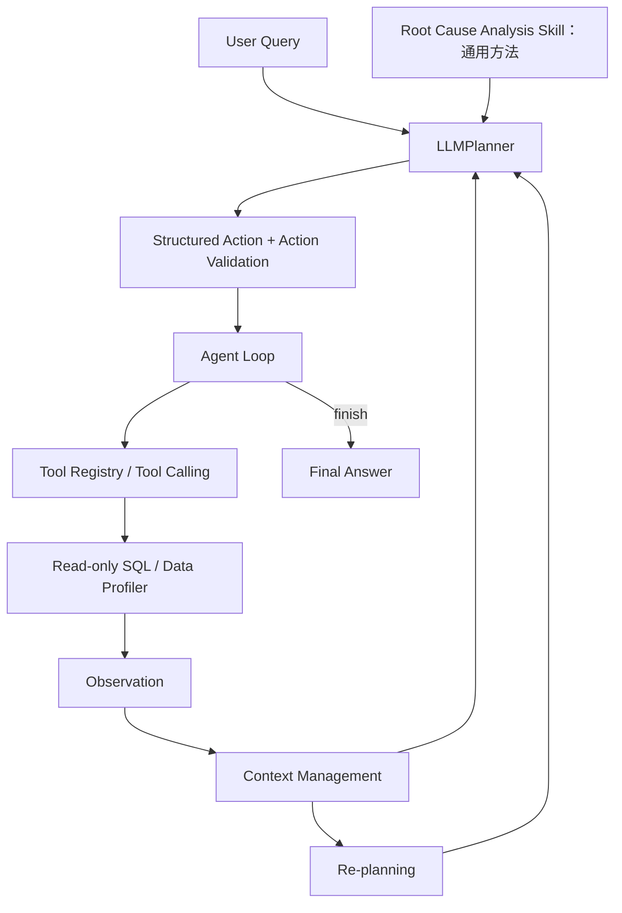

# BusinessInsight Agent

**从电商指标异动出发，结合可核对的 SQL 分析与有证据约束的 Agent 决策。**

**核心发现（确定性分析）**：2017-11 → 2017-12 的 Product GMV 从 1,010,271.37 降至 743,914.17，环比 **−26.36%**；订单量贡献净下降的 **91.87%**。项目交付可追溯业务报告、Tableau Dashboard，并实现 Planner / Agent Loop、只读 SQL、Context Engineering、Skill、MCP 与 Eval。

[两分钟作品导览](docs/portfolio_guide.md) · [业务报告](output/reports/agent_business_report.md) · [Tableau 公开副本](output/tableau/BusinessInsight_Dashboard_public.twb) · [交付检查清单](docs/release_checklist.md)

本项目面向数据分析与 AI 应用实践，围绕一个业务问题展开：**Olist 数据中是否存在 GMV 明显下降的完整月份？如果存在，主要由哪些因素驱动？**

项目同时交付两类成果：一份由确定性 SQL / Python 完成、经过对账的业务 Ground Truth，以及支持自主选择查询、接收 Observation、重新规划的 Agent 原型。不使用 LangChain、CrewAI 等 Agent 框架。

**先体验（无需 API Key）：** 在项目根目录运行 `python scripts/run_business_insight_demo.py --mode offline`。回放必需的已验证汇总证据已纳入提交白名单，无需原始数据、SQLite 或 pip 安装。这是带来源说明的确定性回放，不伪装成实时 LLM 推理。

> 当前验证状态：本地 MCP 通信已实际验证；Tableau Dashboard 已由用户在 Tableau 2025.1 中完成搭建与验证。最终复杂 LLM Demo 在第 2 轮因 HTTP 429 中止，未完成业务归因。下文案例和示例业务报告来自独立确定性分析，不是该次 Agent Demo 的输出。

## Project Overview

数据来自 Olist Brazilian E-Commerce Dataset，包含订单、商品明细、客户、卖家、支付、评价、地理位置及品类翻译等九张 CSV。项目内 SQLite 以 `orders`、`order_items`、`customers` 等名称提供分析接口。已有质量报告记录了 99,441 个订单、112,650 条商品明细；订单粒度与商品明细粒度不能混用。

来源：[Kaggle / Olist 官方数据集](https://www.kaggle.com/datasets/olistbr/brazilian-ecommerce)，页面许可为 CC BY-NC-SA 4.0；归属、转换与公开范围见 [DATA_NOTICE.md](DATA_NOTICE.md)。原始 CSV（尤其客户级与评价正文）、本地约 160 MB SQLite 不提交 GitHub。只有需要重新查询工具或运行完整数据集测试时，才从来源页面下载解压九张 CSV 到 `data/`，保留文件名，并执行下方一次性导入命令。Offline Demo 只读仓库内聚合摘要，不依赖这些原始文件。

业务分析侧关注指标口径、期间可比较性、贡献度、下钻及结论边界；Agent 工程侧实现 Planner、执行循环、工具注册、上下文压缩、结构化输出、安全 SQL、可复用 Skill 和离线评测。

Agent 已支持：检查数据结构、调用只读 SQL、根据工具结果选择下一步、将工具错误反馈给 Planner、保存 Action / Observation 历史并输出答案。此前真实运行已观察到多步工具调用、Observation 驱动决策和 SQL 别名错误修正；复杂归因任务的稳定端到端完成仍未验证。

## Business Analysis

### 指标定义与分析范围

| 指标 | 定义 |
|---|---|
| Product GMV | `SUM(order_items.price)`，不含运费，不与 `payment_value` 混用 |
| Order Volume | 同一分析范围内、有有效商品明细的 `COUNT(DISTINCT order_id)` |
| AOV | Product GMV / Order Volume |
| 月份 | `orders.order_purchase_timestamp` 的自然月 |

Ground Truth 的有效明细要求订单可关联、价格非空且非负、购买日期可解析。主分析保留所有状态中有有效明细的订单，衡量创建订单的商品金额，**不是收入、净成交额或退款后 GMV**；报告另含订单状态敏感性分析。

### 从发现异动到定位贡献

1. **Data Quality Check**：检查日期覆盖、缺失、重复键、孤立明细、表粒度及 JOIN 前后金额与行数。
2. **Monthly Trend / MoM**：先确认可比较月份，再计算 GMV、订单量、AOV 及环比；只与紧邻的上一个自然月比较。
3. **Anomaly Detection**：以 `GMV MoM <= -10%` 作为探索性下降规则，再按绝对下降金额选主分析月份，不提前指定月份。这不是统计显著性检验。
4. **Metric Decomposition**：使用 `GMV = Order Volume × AOV`，分辨数量与客单价的算术贡献。
5. **Dimension Contribution**：按 Category、Customer State、Seller 比较上期值、本期值、绝对变化、增长率和对总体变化的贡献。
6. **Dynamic Drill Down**：根据已观察到的贡献集中度选择进一步交叉下钻，具体 SQL 和顺序由 Planner 决定，Skill 不固定 SQL 链。
7. **Evidence / Hypothesis**：将数据可证明的变化与需要外部数据验证的原因分开报告。

令上期为 0、当期为 1，V 为订单量、A 为 AOV：

```text
订单量贡献 = (V1 − V0) × (A1 + A0) / 2
AOV 贡献   = (A1 − A0) × (V1 + V0) / 2
两项之和   = GMV1 − GMV0
维度贡献率 = 该组 GMV 变化 / 总体 GMV 变化
```

维度成员取两期并集，保留新增、消失和 Unknown 组；各维度分别对账到总体变化。三个维度是不同观察视角，贡献率不能跨维度相加。禁止直接 `order_items JOIN payments` 后累计金额；多对多扩张应通过先聚合到共同粒度解决，`SUM(DISTINCT 金额)` 不能替代粒度治理。

## Ground Truth Case：2017-11 → 2017-12

以下数字仅摘自已有 [Ground Truth 报告](output/reports/gmv_ground_truth.md) 和 [结构化摘要](output/reports/gmv_ground_truth_summary.json)，展示时作舍入，未重新计算原始数据。此案例由确定性 SQL / Python 完成，供业务复核和 Agent Eval 使用。

### 期间选择

原始订单时间范围为 2016-09-04 至 2018-10-17。报告采用保守规则：订单记录与有效明细订单在自然月每一天均有记录，才列为可比较月；两期均合格才计算 MoM。

由此得到可比较范围 **2017-02 至 2018-07**，内部无零订单 / 零有效明细订单日断档。2018-08 有效明细仅覆盖 29 天，2018-09 / 10 及稀疏首部月份被排除。日覆盖是抽取完整性的代理，不是完整性的证明。

| 候选月份（按下降金额排序） | GMV 变化 | GMV MoM |
|---|---:|---:|
| 2017-12 | -266,357.20 | -26.3649% |
| 2018-06 | -131,393.37 | -13.1853% |
| 2018-02 | -105,851.65 | -11.1419% |
| 2017-06 | -73,032.54 | -14.4313% |

选择 **2017-12**，依据是合格候选中绝对 GMV 下降最大。完整月度趋势见 [monthly_metrics.csv](output/reports/monthly_metrics.csv)。

### 指标变化与分解

| 指标 | 2017-11 | 2017-12 | 环比 |
|---|---:|---:|---:|
| Product GMV | 1,010,271.37 | 743,914.17 | -26.3649% |
| Order Volume | 7,451 | 5,624 | -24.5202% |
| AOV | 135.588695 | 132.274924 | -2.4440% |

| 分解项 | 对 GMV 变化的贡献 | 占净下降比例 |
|---|---:|---:|
| 订单量 | -244,693.42 | 91.8666% |
| AOV | -21,663.78 | 8.1334% |
| 合计 | -266,357.20 | 100% |

**主要算术驱动是订单量下降，AOV 下降进一步放大了 GMV 降幅。** 报告以未舍入值完成分解对账；不能将这一算术分解解释为流量或促销的因果证明。

### 维度贡献与下钻

下表为每个维度中下降贡献最大的成员：

| 维度 / 成员 | 上期 GMV | 当期 GMV | 绝对变化 | 占总体净下降 |
|---|---:|---:|---:|---:|
| Category：`cama_mesa_banho` | 89,412.54 | 50,505.85 | -38,906.69 | 14.6070% |
| Customer State：`SP` | 360,251.89 | 280,740.14 | -79,511.75 | 29.8515% |
| Seller：`7e93a43ef30c4f03f38b393420bc753a` | 20,075.76 | 690.98 | -19,384.78 | 7.2777% |

完整成员贡献见 [dimension_contribution.csv](output/reports/dimension_contribution.csv)。各维度组内变化之和均与总体变化对账。

报告比较三个维度中最大下降成员的绝对金额后，选择 **SP** 继续下钻：

- SP → Category：`cama_mesa_banho` 从 37,541.65 降至 23,143.70，变化 **-14,397.95**，占 SP 净下降 **18.1080%**。
- SP → Seller：上述卖家从 8,434.87 降至 379.00，变化 **-8,055.87**，占 SP 净下降 **10.1317%**。

两种下钻分别与父组变化对账，不能相加解释 SP 下降。明细见 [gmv_drill_down.csv](output/reports/gmv_drill_down.csv)。

### 业务解读边界

**Evidence**：完整可比较期间内，2017-12 的下降金额最大；订单量贡献占主要部分；SP、上述品类与卖家存在明确的下降集中度。

**Hypothesis**：流量减少、前月活动拉高基数、库存或商家供给变化可能解释订单量变化，但当前交易数据不能确认。需要访问与转化漏斗、活动日历、库存和商家运营日志验证。不能仅凭月份位置就认定促销为原因。

建议优先复核 SP 的相关品类和卖家，并补充上述运营数据。该建议是调查优先级，不是已证实的经营干预结论。

## Agent Architecture



- **Planner**：根据问题、Skill 和当前证据决定 `inspect_data`、`run_sql` 或 `finish`；保留 MockPlanner 供离线演示，LLMPlanner 使用固定 `openrouter/free`。
- **Agent Loop**：验证动作、分派工具、保存 Observation，再请求决策；`finish` 是结束动作而非工具。
- **Tools**：执行确定性数据处理，返回结构化 dict，不负责规划。
- **Context**：保存 user_query、plan、history、findings、iteration；Action / Observation 通过 action_id 关联。

初始 plan 是通用框架，不代表 LLM 已完成分析。具体查询由每轮 LLM 决策；模型最终回答不会自动作为已验证 finding 入库。

## Context Engineering

采用 `Raw Tool Result → Compact Observation → Agent Context → Planner View`，避免直接截断整段 profiling 后丢失后部表结构。

- **Compact Schema**：保留表名、行数、字段、候选键、grain、相关缺失和关联信息；默认不传样本行、大量 dtype 或全量缺失统计。原 profiler 仍保留完整能力。
- **History Compaction**：最近一轮保留较完整 Action / Observation；更早动作压缩为工具、状态和结果摘要。已识别修复的 SQL 别名错误记录关联，不永久重复完整错误 SQL。
- **Evidence Preservation**：旧的成功数值 Observation 与来源 action_id 单独保留，schema 独立提供一次。优先压缩低价值历史；预算不足时明确标记证据省略。
- **结果预算**：符合大小条件的小型表格最多保留 30 行，大型结果通常只保留 5 行，单 Observation 字符预算为 6000。容量规则不证明查询就是聚合查询；Planner 仍需控制 SQL 粒度。

原始明细既占上下文、增加数据披露范围，也容易使模型对截断样本产生错误推断。应让数据库计算指标，再将必要结果送给 Planner；`truncated` / `context_truncated` 表示结果不完整，不能当作完整排名。

## Reliability & Safety

| 机制 | 已实现的边界 |
|---|---|
| Structured Output | 请求严格 JSON Schema；区分 HTTP response JSON、content JSON 和 Action Validation 错误 |
| Action Validation | 校验动作集合、arguments、SQL query、finish answer 和 reason；非法动作不执行 |
| Read-only SQL | SELECT / WITH 入口检查、单语句执行、`mode=ro`、`query_only` |
| SQLite authorizer | 阻止写入、DDL、ATTACH、PRAGMA、扩展加载等越权操作 |
| 有限执行 | 默认最多 10 iterations；SQL 最多返回 1000 行，设置约 5 秒执行超时 |
| Error Recovery | SQL 工具错误回传 Planner，允许根据 Observation 修正；不保证每类错误均可恢复 |
| API 失败停止 | 无自动重试、无收费模型 fallback；外部错误保留安全诊断 |
| Evidence grounding | findings 要求引用成功 Observation；语义正确性仍需评测和人工复核 |

`.env` 已被忽略，密钥不写入代码或日志。安全日志不 dump 认证头或完整远端错误对象。只读 SQL 防止数据被修改，但不能自动保证指标定义、JOIN 粒度或业务结论正确。

## MCP Integration

使用官方 **MCP Python SDK 1.30.0**，以本地 stdio 暴露 `inspect_data()` 与 `run_sql(query: str)`。服务端直接复用原工具，返回 MCP `structuredContent`，不另写业务逻辑或放宽 SQL 安全限制。

```text
现有 Agent → 注入 MCP Tool Registry → MCP Client
         → stdio MCP Server → 原 inspect_data / run_sql
```

普通 Tool Calling 可以是进程内 Python 函数调用；MCP 增加标准化的初始化、工具发现、Schema 和跨进程调用协议。它不替代 Planner，也不要求调用 LLM。默认 Agent Registry 不变，MCP 显式启用。

目前同步适配器每次调用启动一个子进程，属于本地演示，不是生产级连接池或服务部署。启动、Schema 与测试说明见 [MCP README](src/mcp_integration/README.md)。

## Root Cause Analysis Skill

[skills/root-cause-analysis/SKILL.md](skills/root-cause-analysis/SKILL.md) 将一次性分析步骤沉淀为可复用方法：

```text
Data Quality → Metric Definition → Trend / MoM → Decomposition
→ Dimension Contribution → Drill Down → Evidence / Hypothesis → Report
```

归因、下降、异常等问题触发 Planner 加载该 Skill。Skill 描述期间可比较性、指标口径、JOIN 安全、贡献与停止条件；不包含本案例的月份、百分比、地区、品类或卖家答案，也不指定固定 SQL 和维度顺序。

## Agent Eval

Ground Truth 仅供本地 `evals/` 在运行结束后比较，不进入 Planner Prompt 或 Skill。README 展示的案例答案也不是 Planner 的加载来源。

| Eval 维度 | 检查内容 |
|---|---|
| Metric Correctness | GMV、订单量、AOV 与状态口径 |
| Period Correctness | 排除不可比较月份，使用相邻自然月 |
| Anomaly Detection | 主分析月份及下降数值 |
| Decomposition Correctness | 数量 / AOV 分解及主要驱动 |
| Dimension Attribution | 品类、客户州、卖家贡献 |
| Drill-down Quality | 高贡献维度的合理下钻 |
| Evidence Grounding | 结论可追溯至成功 Observation |
| Hypothesis Discipline | 未证实原因不冒充事实 |
| Tool Safety | 只读 SQL 与 JOIN 粒度 |
| Task Completion | 有证据的最终回答与正常 finish |

每项输出 **PASS / PARTIAL / FAIL**，并保存 expected、actual、evidence、reason，不只给总分。数值允许合理浮点容差，缺失证据不能完全 PASS。结构化 actual 由外部评审从回答提取；复杂 JOIN 和因果语义需人工复核，当前不是通用自动语义裁判。详见 [Eval README](evals/README.md)。

最终真实 Demo 的如实结果：**2 iterations、2 次 LLM 请求、1 次 inspect_data、0 次 SQL 调用**；第 2 轮 HTTP 429（`Provider returned error`）后停止，未 finish。离线 Eval 为 **0 PASS / 9 PARTIAL / 1 FAIL（Task Completion）**。这反映任务未完成和证据不足，不应描述为 Agent 已作出错误业务归因。

公开评测：[final_agent_eval.json](output/reports/final_agent_eval.json)。完整原始运行轨迹 `output/reports/final_agent_demo.json` 仅本地保留，避免发布模型请求上下文和 profiler 样本；不会为了包装结果删除该本地记录。

## Final Business Report Generation

```text
Business Question → Agent Loop → Tool Calling → Evidence
→ Root Cause Analysis → Final Report → Tableau Dashboard
```

新增独立的 `src/report_generator.py` 输出层：接收带来源路径的结构化 Evidence，生成 Executive Summary、异常概览、指标分解、维度归因、下钻、证据、假设、限制与 Next Checks。它不重新计算整套分析，不读取 Ground Truth，也不把自由文本 answer 当成事实。

通过 `sources_from_context()` 复用成功 Tool Observation 与 action_id/SQL 引用；调用方显式映射业务字段后生成报告，无须修改 Agent Loop。缺少字段或分析未完成时明确保留这一状态，不用标准答案补全。现阶段未实现从任意 SQL 自动识别全部业务语义。

Structured Output 为九个章节的引用数组，严格校验 ID、章节归属及完整性。MVP 中可选 LLM 只组织已有引用，不写入新金额、比例或因果解释；核心数字由确定性模板直接读取经来源一致性校验的 Evidence。默认完全离线；客户端不可用、429、timeout、空内容或非法输出时直接生成 Deterministic Fallback，不重试。

[示例业务报告](output/reports/agent_business_report.md) 使用已有确定性结果经通用输出层生成；[Evidence 输入](output/reports/agent_business_report_evidence.json) 和 [输出 Schema](output/reports/agent_business_report_schema.json) 可用于追溯。示例不是最终复杂 Agent Demo 的成功证明。接口、信任边界及接入方式见 [Report Generation 文档](docs/report_generation.md)。

### Tableau Dashboard：已完成

本地原 Workbook `output/tableau/BusinessInsight_Dashboard.twb` 已由用户在 Tableau 2025.1 中完成搭建和验证，保持原样且不提交。GitHub 提供 [BusinessInsight_Dashboard_public.twb](output/tableau/BusinessInsight_Dashboard_public.twb) 与同目录五张 CSV：公开副本只将五处本机绝对连接目录替换为 `.`，图表逻辑未改动。XML 和文件引用已核对，但公开副本尚待另一台机器的 Tableau UI 验证；若提示找不到源文件，在 Tableau 重新定位同目录 CSV。

Agent / deterministic analysis 提供分析结果和 Tableau-ready 数据，最终 Dashboard 使用 Tableau 构建；**Dashboard 不是 Agent 自动生成的**。报告和 Dashboard 是对同一分析证据的两种交付方式，本次未重新生成 Workbook 或修改 Tableau CSV。

## End-to-End Demo

```powershell
python scripts/run_business_insight_demo.py --mode offline
# 可省略 --mode；支持的同义问题示例
python scripts/run_business_insight_demo.py --question "Why did Product GMV decline?"
```

终端展示七个阶段：Business Question → Data Inspection → Metric Analysis → Anomaly Detection → Root Cause Analysis → Evidence Validation → Final Report。数据检查、指标、异动与归因阶段明确标为 **saved evidence replay**；复用既有验证结果，不重新查询数据库或计算 Ground Truth。Evidence 校验与报告生成在本次运行实际执行。

最终展示选定期间、GMV 前后值与 MoM、主要指标驱动、品类/客户州/卖家贡献，以及报告和已完成 Tableau Workbook 的路径。输出包括：

- [demo_trace.json](output/demo/demo_trace.json)：mode、question、stages、evidence references、fallback_used、completion_status、交付物路径。
- [demo_summary.md](output/demo/demo_summary.md)：用于面试速览的流程、真实执行模式与案例结论。
- [agent_business_report.md](output/reports/agent_business_report.md)：通过已有报告层生成的确定性案例报告。

离线问题采用明确的支持列表（默认英文问题、上述简短英文问题与原 Olist 中文问题）。其他问题会提示 replay 的边界并退出，不用固定案例冒充通用回答。离线入口仅需 Python 标准库和已有结构化摘要，不需要数据库、API Key 或 MCP SDK。

### 可选 Agent Mode（显式联网）

```powershell
python scripts/run_business_insight_demo.py --mode agent
```

该模式才会复用现有 LLMPlanner、Skill、Agent Loop 与只读 Tools，固定 `openrouter/free`、最多 10 轮；需要基础依赖、Olist 数据库和本地 OpenRouter 配置。运行前需授权将必要分析上下文发送到 Provider。此入口不改变 Prompt、模型、SQL 安全或重试策略。

Provider 失败、非法输出或运行未完成时，先保留真实运行状态与可观察事件摘要；仅在问题匹配已支持案例时，提示后进入确定性回放，并记录 `fallback_used=true`。此后读取的 Ground Truth adapter 不会再送回 Planner。其他问题不套用 Olist 标准答案。

正常 finish 时，只从成功 SQL Observation 建立字段引用并生成 `output/demo/live_agent_report.md`；不读取标准答案。当前尚不能自动为任意 SQL 判断期间、分解和归因语义，因此状态为 `agent_finished_report_partial`，需要人工复核映射，不能据此宣称完整复杂归因已通过。

`completed_replay` 表示离线案例流程完成，不表示真实 Agent 成功。退出码：0=报告输出成功（包括明确标注的回放或部分报告）；1=本地文件/验证失败；2=不支持的问题或无匹配回放。运行日志不保存认证信息、环境变量、模型隐藏推理或原始异常文本。本轮 Agent 分支只使用 mock 测试，未调用真实 API。

## Testing

最近一次完整本地离线验证：**99 项测试通过，无跳过**。完整测试需要基础依赖、可选 MCP SDK、原始九张 CSV 与已导入 SQLite；这与只需标准库的 Offline Demo 不同。覆盖无 Key/无网络回放、数值一致性、受保护交付物哈希、Provider 失败降级、日志脱敏、不支持问题、真实模式与 Ground Truth 隔离及直接脚本启动。普通测试不调用真实 LLM API；MCP 测试实际启动本地 stdio 子进程。

完整日志 `output/demo/demo_tests.txt` 本地保留；公开验收状态见 [release_checklist.md](docs/release_checklist.md)。未安装可选 MCP SDK 时，其 6 项测试会明确 skipped，不能视为全部验证通过。测试通过不代表生产级可用性或复杂 Agent 业务任务已端到端成功。

## Limitations

- OpenRouter free provider 存在 429；最终复杂真实 Demo 因外部 Provider Rate Limit 中止，尚不能声称 Agent 已独立完成完整归因。
- 本地 Ground Truth、Skill 文件、MCP、Eval 和离线测试不依赖该 Provider；Skill 的真实 LLM 决策应用仍取决于模型可用性。
- 交易数据不包含完整流量、活动、库存和竞争信息；维度贡献与指标分解是描述性证据，不证明因果。
- 每日覆盖不能证明没有漏抽；自然月天数、季节性、状态快照和未扣退款影响业务解释。
- Context 预算可能舍弃旧证据，现有 findings 机制不等于自动验证所有模型结论。
- MCP 仅为本地 stdio 演示，未提供生产级鉴权、部署或并发连接管理。

## Project Structure

```text
BusinessInsight-Agent/
├── data/                         # 九张原始 CSV 与 olist.db（本地）
├── src/
│   ├── agent.py                  # 执行循环与 Tool Registry
│   ├── context.py                # 上下文与 Observation 压缩
│   ├── schema_summary.py         # Compact Schema
│   ├── report_generator.py       # Evidence 校验、报告 Schema、确定性输出/降级
│   ├── planner.py                # Planner 接口与 MockPlanner
│   ├── llm/                      # LLMPlanner、客户端、历史压缩、Skill 加载
│   ├── tools/                    # Data Profiler 与只读 SQL
│   └── mcp_integration/           # 可选 stdio Server / Client
├── skills/root-cause-analysis/    # 通用分析方法
├── evals/                        # 独立离线评测
├── scripts/                      # 统一 Demo 入口、报告与 MCP Demo
├── tests/                        # 99 项离线测试
├── docs/                         # 报告层接口及接入说明
├── output/reports/               # 业务报告、运行轨迹与评测结果
├── output/tableau/               # Tableau-ready CSV 与已完成 Dashboard
├── output/demo/                  # 可观察运行轨迹与面试摘要
├── requirements.txt              # pandas / matplotlib
├── requirements-mcp.txt          # 可选官方 MCP SDK
└── README.md
```

原始数据、数据库、`.env`、完整运行日志和调试产物被 Git 忽略。精选报告、回放摘要与轨迹、必要聚合证据、Tableau CSV 和公开 Workbook 通过逐文件白名单保留。新克隆仓库可直接运行离线回放；无需分发 Key 或私有本机环境。

## Quick Start（本地、无 LLM API）

优先运行一条命令（项目已有交付物时，无 Key、无需安装基础分析依赖）：

```powershell
python scripts/run_business_insight_demo.py --mode offline
```

回放所需 `output/reports/gmv_ground_truth_summary.json`、Tableau 公开副本及五张 CSV 已列入提交白名单。新克隆使用公开 Workbook 路径，本机存在原 Workbook 时仍优先显示原件。缺文件时 CLI 明确提示，不生成模拟数据。当前验证环境为 Python 3.11.6；已有虚拟环境也可使用 `.\.venv\Scripts\python.exe` 替代 `python`。

以下是需要运行原工具、MCP 或完整测试时的环境准备：

使用 **Python 3.11.6**，在项目根目录 PowerShell 执行。若已有 `.venv`，直接复用，不重新创建。

```powershell
# 仅首次创建环境；先确认 python --version 为 3.11.6
python -m venv .venv
& .\.venv\Scripts\python.exe -m pip install -r requirements.txt
# MCP 演示和全部测试需要此可选依赖
& .\.venv\Scripts\python.exe -m pip install -r requirements-mcp.txt
```

将完整九张 Olist CSV 放入 `data/`，保留原始文件名。仅在 `data/olist.db` 不存在时导入；已有数据库会拒绝覆盖：

```powershell
& .\.venv\Scripts\python.exe -X utf8 -m src.tools.sql_tool --import-data
```

日常验证：

```powershell
# 离线 MockPlanner + 本地 SQL，打印 Action / Observation
& .\.venv\Scripts\python.exe -X utf8 -m src.agent
# 真实本地 MCP 通信 + MockPlanner，无 LLM 请求
& .\.venv\Scripts\python.exe -X utf8 -m scripts.demo_mcp
# 全部离线测试
& .\.venv\Scripts\python.exe -X utf8 -m unittest discover -s tests -v
# 基于已有确定性结果生成示例业务报告（不调用 LLM）
& .\.venv\Scripts\python.exe -X utf8 -m scripts.demo_business_report
```

已有 Ground Truth 与运行记录时，可单独进行离线评测；使用新输出名保留最终评测：

```powershell
& .\.venv\Scripts\python.exe -X utf8 -m evals.root_cause_eval --run output/reports/final_agent_demo.json --output output/reports/local_eval_review.json
```

以上 Quick Start 无需 API Key，不会自动调用模型。仅显式选择 End-to-End Demo 中的 `--mode agent` 才可能产生真实 Provider 请求。
