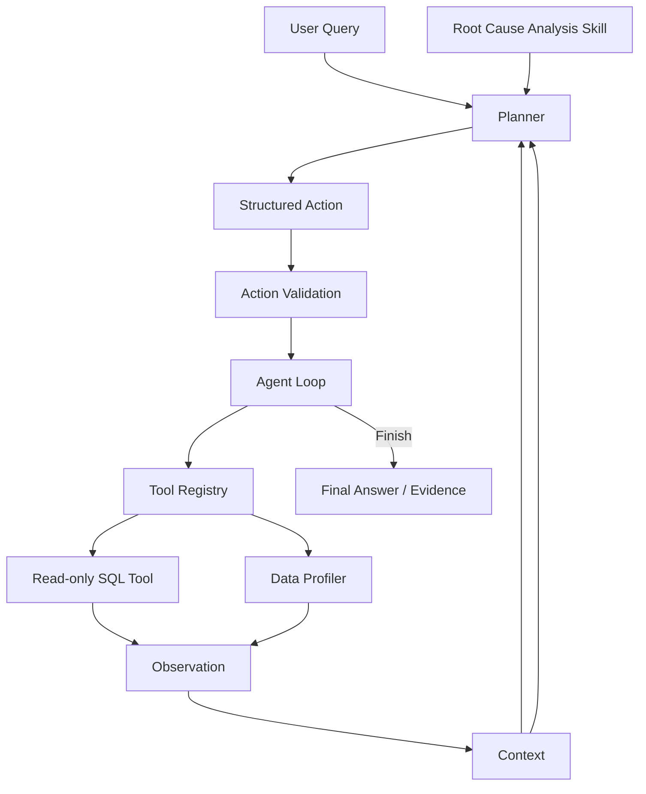

# BusinessInsight Agent

> **智能业务分析与异动归因｜SQL/Python · Tableau · AI Agent**

基于 Olist 电商数据构建智能业务分析 Agent，围绕 GMV、订单量和客单价完成 **指标监控 → 异动识别 → 指标拆解 → 多维归因 → 下钻分析 → 自动报告**，并使用 Tableau 搭建业务分析 Dashboard。

项目同时覆盖传统数据分析与 AI Agent 应用：业务分析侧使用 SQL/Python 完成指标计算、异动归因和结果验证；Agent 侧实现 Agent Loop 与 Tool Calling，并结合 Skill、MCP、Eval 等机制实现分析流程自动化。

## 核心结果

在完整可比较月份中识别出 GMV 明显下降月份，并选择绝对下降金额最大的 **2017-11 → 2017-12** 进行归因分析：

| 核心指标 | 2017-11 | 2017-12 | 环比变化 |
|---|---:|---:|---:|
| Product GMV | 1,010,271.37 | 743,914.17 | **-26.36%** |
| Order Volume | 7,451 | 5,624 | **-24.52%** |
| AOV | 135.59 | 132.27 | **-2.44%** |

进一步进行指标拆解：

- **订单量下降贡献 91.87%**，是 GMV 下降的主要算术驱动因素；
- AOV 下降贡献 **8.13%**；
- 从 **Category / Customer State / Seller** 三个维度进行贡献分析；
- Customer State 中 **SP** 对总体 GMV 净下降贡献 **29.85%**；
- 继续对 SP 进行 Category / Seller 下钻，定位主要下降来源。

> 上述结论属于交易数据能够支持的 Evidence。流量、促销、库存和商家运营变化等可能原因需要额外运营数据验证，不作为已证实因果结论。

## 项目成果

**数据分析**

`SQL` `Python` `指标体系` `MoM` `指标拆解` `贡献分析` `Drill Down` `Tableau`

**AI Agent**

`Agent Loop` `Tool Calling` `Structured Output` `Skill` `MCP` `Eval` `Evidence Validation`

**工程与交付**

`Read-only SQL` `Context Engineering` `Error Recovery` `Fallback` `Offline Demo` `99 Tests`

## 快速查看

- [两分钟作品导览](docs/portfolio_guide.md)
- [业务分析报告](output/reports/agent_business_report.md)
- [Tableau Dashboard](output/tableau/BusinessInsight_Dashboard_public.twb)
- [Tableau 数据与说明](output/tableau/README.md)
- [Demo Summary](output/demo/demo_summary.md)
- [Demo Trace](output/demo/demo_trace.json)
- [报告生成机制](docs/report_generation.md)

---

# 1. Business Problem

项目围绕一个典型业务分析问题展开：

> **Olist 电商数据中是否存在 GMV 明显下降的完整月份？如果存在，下降主要由什么因素驱动？**

分析流程不是直接指定某个月份，而是先检查数据完整性和可比较期间，再从月度趋势中识别异常月份。

整体分析链路：

```text
Data Quality Check
        ↓
Monthly KPI Monitoring
        ↓
Anomaly Detection
        ↓
Metric Decomposition
        ↓
Dimension Contribution
        ↓
Dynamic Drill Down
        ↓
Evidence / Hypothesis
        ↓
Business Report
```

---

# 2. Data & Metric Definition

数据来源于 **Olist Brazilian E-Commerce Dataset**，包括订单、商品明细、客户、卖家、支付、评价、地理位置和品类翻译等数据。

数据来源及公开范围详见：

[DATA_NOTICE.md](DATA_NOTICE.md)

原始 CSV 和本地 SQLite 数据库不提交至本仓库。

## 核心指标

| 指标 | 定义 |
|---|---|
| Product GMV | `SUM(order_items.price)` |
| Order Volume | `COUNT(DISTINCT order_id)` |
| AOV | Product GMV / Order Volume |
| Month | `order_purchase_timestamp` 自然月 |
| GMV MoM | 当月 GMV 相对上一自然月变化率 |

主分析衡量订单创建对应的商品金额，不将 Product GMV 解释为退款后收入或净成交额。

同时避免直接连接多个一对多表后累计金额，例如：

```text
order_items → orders ← payments
```

需要先处理数据粒度，再进行指标聚合，避免 JOIN 导致金额重复计算。

---

# 3. Anomaly Detection

首先检查月份数据覆盖情况，只在相邻且可比较的完整月份之间计算 MoM。

项目采用：

```text
GMV MoM <= -10%
```

作为探索性的明显下降规则，再按照 **绝对 GMV 下降金额** 选择主分析月份。

识别出的主要下降月份包括：

| 月份 | GMV变化 | GMV MoM |
|---|---:|---:|
| 2017-12 | -266,357.20 | **-26.36%** |
| 2018-06 | -131,393.37 | -13.19% |
| 2018-02 | -105,851.65 | -11.14% |
| 2017-06 | -73,032.54 | -14.43% |

因此选择：

**2017-11 → 2017-12**

作为主要异动归因案例。

---

# 4. Metric Decomposition

使用：

```text
GMV = Order Volume × AOV
```

对 GMV 变化进行对称分解。

令上一期为 0、当前期为 1：

```text
订单量贡献 = (V1 − V0) × (A1 + A0) / 2

AOV贡献 = (A1 − A0) × (V1 + V0) / 2
```

结果：

| 分解项 | GMV变化贡献 | 占净下降比例 |
|---|---:|---:|
| Order Volume | -244,693.42 | **91.87%** |
| AOV | -21,663.78 | **8.13%** |
| Total | -266,357.20 | 100% |

因此：

> **2017-12 GMV下降的主要算术驱动因素是订单量下降，而非客单价的大幅下降。**

这里的“贡献”属于指标算术分解，不等同于因果推断。

---

# 5. Dimension Attribution

进一步从三个维度分析 GMV 下降来源：

- Category
- Customer State
- Seller

每个维度分别计算：

```text
Previous GMV
Current GMV
Absolute Change
Growth Rate
Contribution Rate
```

其中：

```text
Contribution Rate
= Dimension Member GMV Change / Total GMV Change
```

三个维度属于不同分析视角，**不能跨维度直接累加贡献率**。

主要结果：

| 维度 | 主要下降成员 | GMV变化 | 对总体下降贡献 |
|---|---|---:|---:|
| Category | `cama_mesa_banho` | -38,906.69 | **14.61%** |
| Customer State | `SP` | -79,511.75 | **29.85%** |
| Seller | `7e93a43ef30c4f03f38b393420bc753a` | -19,384.78 | **7.28%** |

---

# 6. Drill Down

根据维度贡献集中度，选择 **SP** 继续下钻。

### SP → Category

`cama_mesa_banho`

```text
37,541.65 → 23,143.70
Change = -14,397.95
Contribution to SP decline = 18.11%
```

### SP → Seller

Seller：

```text
7e93a43ef30c4f03f38b393420bc753a
```

结果：

```text
8,434.87 → 379.00
Change = -8,055.87
Contribution to SP decline = 10.13%
```

Category 与 Seller 是两种不同的下钻视角，因此两者贡献不能直接相加。

---

# 7. Tableau Dashboard

基于分析结果构建 Tableau Dashboard，主要包括：

- Product GMV Trend & Anomalies
- Product GMV KPI
- Order Volume KPI
- AOV KPI
- GMV MoM KPI
- GMV Decline Driver Decomposition
- Category Contribution Top 10
- State Contribution Top 10
- Seller Contribution Top 10
- SP Drill Down

Tableau 使用的公开聚合数据位于：

```text
output/tableau/
```

公开 Workbook：

[BusinessInsight_Dashboard_public.twb](output/tableau/BusinessInsight_Dashboard_public.twb)

详细说明：

[Tableau README](output/tableau/README.md)

---

# 8. Agent Architecture

在确定性业务分析基础上，进一步构建 BusinessInsight Agent，使模型能够根据业务问题自主选择工具、读取 Observation 并决定下一步分析动作。



Agent 的基本循环：

```text
Decision
   ↓
Action
   ↓
Tool Execution
   ↓
Observation
   ↓
Context Update
   ↓
Next Decision
```

---

# 9. Tool Calling & SQL Safety

Agent 当前主要支持：

### Data Profiler

用于检查：

- 数据表结构
- 字段信息
- 数据规模
- 基础数据质量

### SQL Tool

用于执行业务分析 SQL。

SQL Tool 设置为 **Read-only**，限制：

```text
SELECT / WITH
```

并加入：

- SQL Action Validation
- SQLite Authorizer
- Row Limit
- Error Observation

如果 SQL 执行失败，错误信息会作为 Observation 返回给 Planner，由模型重新规划。

真实测试中已观察到：

```text
SQL字段歧义
    ↓
Tool Error
    ↓
Observation
    ↓
Planner修正Alias
    ↓
重新执行成功
```

---

# 10. Context Engineering

Agent 不直接把全部原始数据和无限历史塞入 Prompt，而是对上下文进行结构化管理。

包括：

- Schema Compaction
- Observation History
- Evidence Preservation
- Structured Compaction

目标是在控制上下文长度的同时保留业务分析所需的重要证据。

---

# 11. Root Cause Analysis Skill

项目将稳定的异动分析方法封装为可复用 Skill：

```text
skills/root-cause-analysis/SKILL.md
```

Skill 定义通用分析原则，包括：

```text
指标口径确认
    ↓
期间完整性检查
    ↓
异常识别
    ↓
指标拆解
    ↓
维度贡献
    ↓
动态下钻
    ↓
Evidence / Hypothesis
```

Skill 提供分析方法，而不是固定 SQL，因此 Planner 仍可根据 Observation 动态决定下一步动作。

---

# 12. MCP Integration

项目使用 **MCP（Model Context Protocol）** 对工具访问进行标准化。

结构：

```text
Agent
  ↓
MCP Registry
  ↓
MCP Client
  ↓
stdio
  ↓
MCP Server
  ↓
SQL Tool / Data Profiler
```

当前 MCP 为本地 stdio 实现。

已实际验证 Agent 可以通过 MCP 调用工具并获取分析结果。

---

# 13. Evidence-grounded Report Generation

项目实现独立 Report Generator：

```text
Successful Observation
        ↓
Explicit Evidence Mapping
        ↓
Source Consistency Validation
        ↓
Structured Report
        ↓
Markdown
```

报告包含：

```text
executive_summary
anomaly_overview
metric_decomposition
dimension_attribution
drill_down_findings
evidence
hypotheses
limitations
recommended_next_checks
```

关键数值必须来自已经验证的 Evidence。

LLM 主要负责：

- 选择 Evidence
- 组织报告结构
- 调整展示顺序

而不是自由生成业务数字。

示例报告：

[agent_business_report.md](output/reports/agent_business_report.md)

---

# 14. Eval

项目构建离线 Eval，用于评估 Agent 分析可靠性。

主要评价维度：

1. Metric Correctness
2. Period Correctness
3. Anomaly Detection
4. Decomposition Correctness
5. Dimension Attribution
6. Drill-down Quality
7. Evidence Grounding
8. Hypothesis Discipline
9. Tool Safety
10. Task Completion

Ground Truth 与 Planner 隔离，避免 Agent 直接读取标准答案。

---

# 15. Error Recovery & Fallback

项目区分：

```text
Tool Error
```

与：

```text
External LLM Failure
```

对于 SQL 等工具错误，Agent 可以根据 Observation 重新规划。

对于：

- HTTP 429
- Timeout
- Empty Response
- Invalid Structured Output

报告生成和 Demo 支持确定性降级机制。

降级过程会明确记录：

```text
fallback_used = true
```

不会将确定性回放伪装成实时 LLM 推理成功。

---

# 16. End-to-End Offline Demo

项目提供无需 API Key 的完整展示入口：

```bash
python scripts/run_business_insight_demo.py --mode offline
```

Offline Demo：

```text
Business Question
        ↓
Validated Analysis Replay
        ↓
Evidence Validation
        ↓
Report Generator
        ↓
Business Report
        ↓
Tableau Deliverable
```

输出包括：

```text
output/demo/demo_summary.md
output/demo/demo_trace.json
output/reports/agent_business_report.md
```

无需：

- API Key
- 原始 CSV
- SQLite Database
- 外部 LLM API

因此招聘者或面试官可以快速查看项目完整分析链路。

---

# 17. Testing

当前项目离线测试：

```text
99 / 99 PASS
0 skipped
```

覆盖：

- SQL Tool
- Data Profiler
- Agent Loop
- Action Validation
- Context Management
- MCP
- Report Generator
- Evidence Validation
- Fallback
- End-to-End Demo

---

# 18. Project Structure

```text
BusinessInsight-Agent/
│
├── src/
│   ├── agent.py
│   ├── planner.py
│   ├── context.py
│   ├── report_generator.py
│   ├── tools/
│   └── mcp_integration/
│
├── scripts/
│   ├── run_business_insight_demo.py
│   └── demo_business_report.py
│
├── skills/
│   └── root-cause-analysis/
│       └── SKILL.md
│
├── evals/
├── tests/
├── docs/
│
├── output/
│   ├── reports/
│   ├── demo/
│   └── tableau/
│
├── DATA_NOTICE.md
├── requirements.txt
└── requirements-mcp.txt
```

---

# 19. Quick Start

## Offline Demo

无需 API Key：

```bash
python scripts/run_business_insight_demo.py --mode offline
```

## 安装完整依赖

```bash
pip install -r requirements.txt
```

如需 MCP：

```bash
pip install -r requirements-mcp.txt
```

原始 Olist 数据不随仓库发布，数据来源和使用方式见：

[DATA_NOTICE.md](DATA_NOTICE.md)

---

# 20. Current Scope

本项目定位为 **数据分析 + AI Agent 应用实践项目**。

当前已验证：

- SQL/Python 确定性业务分析
- GMV异动识别与归因
- 指标拆解与多维下钻
- Tableau Dashboard
- Agent Loop / Tool Calling
- Read-only SQL
- Context Engineering
- Skill
- MCP
- Eval
- Evidence-grounded Report
- Offline Demo
- 99项离线测试

需要明确的边界：

- 当前不是生产级 BI 平台；
- MCP 为本地 stdio 实现；
- Offline Demo 属于已验证 Evidence 的确定性回放；
- 复杂实时 LLM 归因任务仍受到外部模型服务稳定性影响；
- 交易数据能够证明指标变化和贡献集中度，但不能单独证明流量、促销、库存等经营原因。

---

## Tech Stack

`Python` · `SQL` · `SQLite` · `Tableau` · `LLM` · `MCP` · `Structured Output` · `Eval`
